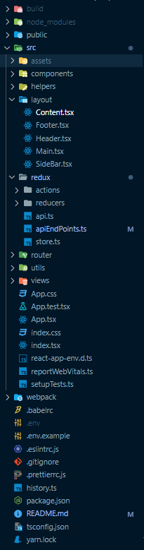

# ReactJs BoilerPlate Code

<mark>This Repo consists of the base setup for ReactJs with Redux-Store Setup with Persistent Storage and API integration.</mark>

## Why ReactJs ?

- History :
  - `2011` - Designed and created in Facebook for internal use.
  - `2012` - Instagram started using it.
  - `2013` - Open-sourced.
  - `2015` - Open-sourced React Native for building native iOS and Android apps.
- Facts :
  - React is a library, Not a framework.
  - It is Flexible.
    - Generates a statis site using Gatsby.
    - Add server rendering with Next.js.
    - Build mobile apps with React Native.
    - Develop Desktop apps using Electron.
    - Create a virtual reality website for 360 experiences using React VR.
  - Great DEV Experience.
  - Supported by Meta.
  - Broad Community Support.

###### Built and maintained by Nainik Mehta [Find Me!](#find-me).

## Let's Dig Into The Code And Explore!

1. [ReactJs Setup](#1-reactjs-setup)
2. [Setup The Project](#2-setup-the-project)
3. [Folder Structure](#3-folder-structure)
4. [Performance Practices And Future Work (Work In Progress️ ✍️)](#4-performance-practices-and-future-work)

  

# `1. ReactJs Setup`

I have setup this boilerplate code using Node Version: `16.13.0` (includes npm `8.1.0`) & React: `17.0.2` 

### [📝] Have ReactJs in your System

1. Install Nodejs
   - You can have the Node LTS and configure it from [Nodejs.org](https://reactjs.org/en/download/) 
     🔗 [**Read More: Getting Started With NodeJS**](https://medium.com/@erickcodes/getting-started-with-node-js-84972881508b)
2. npm install -g create-react-app
3. npx create-react-app appName
4. cd appName ---> code .
5. npm start (to run)

## `2. Setup The Project`

- You can clone this repo from command line using `git clone ${repo_url}`.

  - `git clone https://github.com/NainikCrest/Covid_Survey_Antd.git`

- Run `npm install | yarn`
- Create an `.env` file and add your configuration as per your need similar to reference file `.env.example`
- You can add your base url for API's and apis endpoints from `/src/redux/apiEndPoints.ts`
- ## Auth data.
  - Dummy Email & Password for logging in :
    - Email: `whiteshark@crest.com` | Password: `111111`
- Run `npm start | yarn start` -> to start the app.

## `3. Folder Structure`

<h1 align="center">
  
</h1>

- `Public` -> Our base file root index.js and all other resources like logo is there.
- `src` -> Folder where your whole client configuration and other things will come.
  - `index.tsx` -> This is the main file which start's your client (App Entry Point).
- `.env` -> All our environment variables.
- `.env.example` -> Reference file for `.env`.
- `.gitognore` -> Files & Folder to be excluded from the git.
- `package.json` -> React initialization with all our packages that are used.
- `README.md` -> A general overview of the project.

## Find Me!

Wanna Reach Me Out 📌? 
Reach Me Out At :
[Nainik Mehta](https://github.com/NainikCrest)
<a href="https://www.linkedin.com/in/nainik-mehta-25nk12"></img></a>
<a href="https://twitter.com/Nainik25"></img></a>

<!-- <a href="https://whitelioninfosystems.com/employee/606d5c041c705034c8f53878"></img></a> -->
 
 
Full Stack Developer | Driving Initiatives In Executing Ideas To Reality And Surplus Them | 
Let's Connect To Explore 👇 
<a href="https://www.linkedin.com/in/nainik-mehta-25nk12"></img></a>
<a href="https://twitter.com/Nainik25"></img></a>
<!-- <a href="https://whitelioninfosystems.com/employee/606d5c041c705034c8f53878"></img></a> -->
